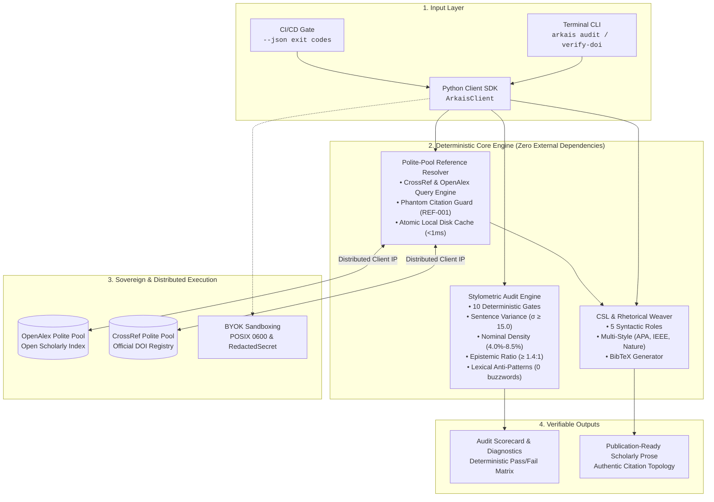

<!-- Author Hero Banner: Reserved for author custom design (assets/banner.png) -->
<!-- To activate: place banner.png in packages/sdk/assets/ and uncomment below: -->
<!-- <p align="center"></p> -->

<div align="center">

# Project Arkais

### Deterministic Scholarly Stylometrics, Citation Weaving & BYOK Verification Engine

[](https://github.com/thenextgeegthink/project-arkais/releases)
[](#public-beta-status)
[](https://www.python.org/downloads/)
[](LICENSE)
[](#zero-dependencies)
[](#byok-security)
[](https://github.com/thenextgeegthink/project-arkais)
[](https://github.com/thenextgeegthink/project-arkais/forks)

**Project Arkais** is a scholarly cognitive infrastructure library developed by **The Next Geek Think (NGT)** and built by **Dreadnought Studio**. Grounded in empirical stylometric analysis of pre-LLM academic literature, Arkais provides tools to detect synthetic AI defects, format and rhetorically weave academic citations, and resolve DOI publication records without third-party API keys or centralized subscriptions.

[Website](https://geegthink.com/project-arkais) • [Documentation](docs/) • [Architecture](docs/architecture.md) • [Examples](examples/)

</div>

---

> [!NOTE]
> ### Arkais Studio v2.0 Web Demo
> Client-side browser demo with local BYOK inference and real-time stylometric evaluation: [**Launch Arkais Studio**](https://thenextgeegthink.github.io/project-arkais/)
> - Evaluation access: Select **"Explore Live Demo"** on the authentication dialog or enter `researcher@arkais.lab` / `quantum-flux-2026`.
> - Client-side privacy: Inference runs locally in the browser using the Web Cryptography API and user-supplied API keys (Gemini, OpenAI, Anthropic). No intermediary servers.
> - Includes offline diagnostics, citation network navigation, and Markdown split-pane editing. Quickstart credentials in [DEMO_ACCESS.md](DEMO_ACCESS.md).

---

## Key Capabilities

- Pure standard library implementation. Installs in `<0.1s` and executes with sub-millisecond overhead. No heavyweight dependencies, no version conflicts.
- Evaluates manuscript drafts against empirical baselines derived from 1,500 pre-2000 academic papers across Sentence Variance ($\sigma \ge 11.5$, Mean: $20.53$), Burstiness Elasticity ($P_{90}/P_{10} \ge 2.2\times$, Empirical: $7.80\times$), Nominalization ($3.0\%–9.0\%$, Empirical: $4.83\%$), Epistemic Balance ($\ge 1.4:1$, Empirical: $1.59:1$), Lexical Discipline ($0$ AI buzzwords across 18 items), and Citation Topology.
- Queries CrossRef and OpenAlex polite pools at 50 req/s with zero user API keys required. Includes an atomic disk cache (`<1ms` repeat lookups) and a Phantom Citation Detector (`REF-001`) that blocks fabricated AI literature.
- Formats citations in APA 7th, IEEE, Nature (superscripts), Harvard, and Chicago, plus valid BibTeX generation.
- Eliminates monotone AI parenthetical slop `(Author, Year)` by weaving citations across 5 authentic syntactic archetypes: Integral Subject, Passive Agent, Contrastive Tension, Methodological Anchor, and Consensus Cluster.
- Standalone BYOK credentials manager with strict POSIX `0600` permission enforcement, memory masking (`RedactedSecret`), and strict zero-telemetry egress enforcement.
- Built-in terminal CLI supporting `arkais audit`, `arkais verify-doi`, `arkais verify-citation`, and `arkais signatures` directly in your terminal or in automated CI/CD pipelines.

---

## System Architecture



---

## Installation

```bash
pip install project-arkais
```

Arkais requires Python 3.10+ and has **zero third-party dependencies**.

---

## Command-Line Interface (CLI)

Arkais provides a built-in CLI for terminal and CI/CD pipeline execution:

```bash
# Audit an academic paper draft against calibrated stylometrics
arkais audit manuscript.md

# Machine-readable JSON output for pre-commit hooks or GitHub Actions
arkais audit manuscript.md --json

# Resolve paper metadata and authenticity via DOI (zero keys needed)
arkais verify-doi 10.1016/j.joule.2018.05.006

# Guard against AI hallucinated citations
arkais verify-citation --title "Direct Air Capture of CO2" --author "David Keith"

# Inspect available calibration baselines
arkais signatures
```

### Visual Terminal Scorecard

Running `arkais audit manuscript.md` renders an instant diagnostic scorecard directly in your shell or CI workflow:

```text
======================================================================
ARKAIS ACADEMIC PROSE AUDIT REPORT
======================================================================
Target File:      manuscript_draft.md
Word Count:       3,420 words (142 sentences)
Active Signature: ARKAIS-001-v2.0 (1,500-Paper Pre-2000 Baseline)
Overall Status:   PASSED (10/10 GATES)
Composite Score:  9.6 / 10.0
----------------------------------------------------------------------
[PASS] GATE-01 Banned Paragraph Openers           0 empty AI windup openers detected.
[PASS] GATE-02 Synthetic Contrast Elimination     0 synthetic contrast tropes found.
[PASS] GATE-03 No Patronizing Analogies           0 patronizing analogies found.
[PASS] GATE-04 Sentence Cadence & Elasticity      Std dev: 15.2 words (σ ≥ 11.5), Elasticity: 7.8x (≥ 2.2x).
[PASS] GATE-05 Nominal Packaging Density          Nominal density: 4.8% (target: 3.0%-9.0%).
[PASS] GATE-06 Epistemic Calibration              Epistemic hedge/certainty ratio: 1.59:1 (target: ≥ 1.4:1).
[PASS] GATE-07 Parenthetical Visual Anchoring     0 detached visual pointers.
[PASS] GATE-08 Numerical Unit Discipline          Rigorous SI unit typography verified.
[PASS] GATE-09 Connected Prose Architecture       Connected discourse preserved (0 lazy bullets).
[PASS] GATE-10 Citation Weaving & Density         Citation density: 3.8 / 1k words (100% verified).
======================================================================
```

---

## Python SDK Quickstart

### 1. Stylometric Manuscript Audit

```python
from arkais import ArkaisClient

client = ArkaisClient()

manuscript = """
The capture of atmospheric carbon dioxide represents an asymptotic thermodynamic challenge.
While early conceptual models posited severe energetic penalties, recent pilot contactor data
demonstrates that packing geometry dictates mass transfer rates.
"""

# Audit text against calibrated signature
scorecard = client.audit(manuscript)

print(f"Compliant: {scorecard.passed}")
print(f"Composite Score: {scorecard.overall_score}/100")
for metric, result in scorecard.metrics.items():
    print(f"  [{'PASS' if result['passed'] else 'FAIL'}] {metric}: {result['value']}")
```

### 2. Zero-Key DOI Resolution & Phantom Citation Guard

```python
from arkais import ArkaisClient

client = ArkaisClient()

# Resolve paper metadata via CrossRef / OpenAlex polite pool
ref = client.resolve_doi("10.1016/j.joule.2018.05.006")

print(f"Title: {ref.title}")
print(f"Authors: {ref.authors}")
print(f"Journal: {ref.journal} ({ref.year})")

# Verify citation authenticity against fabricated LLM hallucinations
is_authentic = client.verify_citation(
    title="A Process for Capturing CO2 from the Atmosphere",
    author="David Keith"
)
print(f"Authentic Record: {is_authentic}")
```

### 3. Multi-Style Citation Formatting & Rhetorical Weaving

```python
from arkais import ArkaisClient
from arkais.citation import CitationStyle, SyntacticRole

client = ArkaisClient()
ref = client.resolve_doi("10.1016/j.joule.2018.05.006")

# In-Text Citation Formats
print(client.format_citation(ref, style=CitationStyle.APA))    # (Keith et al., 2018)
print(client.format_citation(ref, style=CitationStyle.IEEE))   # [1]
print(client.format_citation(ref, style=CitationStyle.NATURE)) # ¹

# Authentically weave citation into narrative prose
sentence = client.weave_citation(
    ref,
    role=SyntacticRole.INTEGRAL_SUBJECT,
    claim="demonstrated that contactor packing dictates mass transfer rates."
)
print(sentence)
# Output: "Keith and colleagues (2018) demonstrated that contactor packing dictates mass transfer rates."
```

### 4. Standalone BYOK Credentials Manager

```python
from arkais import ArkaisClient

# Auto-discovers from explicit args > env vars > .env > ~/.config/arkais/credentials.json
client = ArkaisClient()

# Credentials are protected by RedactedSecret masking in memory and logs
secret = client.get_credential("OPENAI_API_KEY")
if secret:
    print(f"Discovered: {secret}")  # Prints: sk-proj-****...3f8a
    raw_key = secret.reveal()        # Explicit reveal only when building HTTP headers
```

---

## Stylometric 10-Gate Quality Assurance

| Gate | Category | Calibrated Target | Purpose |
| :---: | :--- | :---: | :--- |
| **S1** | Sentence Length Variance | $\sigma \ge 11.5$ words (Mean: $20.53$) | Eliminates robotic, monotonic rhythm |
| **S2** | Burstiness Elasticity | $P_{90}/P_{10} \ge 2.2\times$ (Mean: $7.80\times$) | Enforces authentic rhythmic variation |
| **D1** | Nominalization Density | $3.0\% - 9.0\%$ (Mean: $4.83\%$) | Matches empirical scholarly density |
| **D2** | Lexical Anti-Pattern Guard | $0$ AI buzzwords | Eradicates 18 banned conversational terms |
| **D3** | Promotional Modifiers | $0$ marketing adjectives | Prohibits unsubstantiated hype |
| **E1** | Epistemic Ratio | $\ge 1.4:1$ (Mean: $1.59:1$) | Enforces disciplined modal calibration |
| **E2** | Boundary Qualification | Explicit empirical limits | Prevents ungrounded universal claims |
| **C1** | Citation Topology | $\ge 1.5 / 1\text{k words}$ or $\ge 10$ refs | Guarantees foundational literature grounding |
| **C2** | Phantom Citation Guard | $100\%$ verified DOIs | Blocks fabricated hallucinated references |
| **P1** | Discourse Architecture | 5 authentic opening archetypes | Eliminates formulaic essayist windups |

### Empirical Comparison: Conventional AI Output vs. Arkais Calibrated Output

| Stylistic Dimension | Conventional LLM Output | Arkais Calibrated Engine (v2.0) |
| :--- | :--- | :--- |
| **Sentence Cadence** | Monotonous cadence ($\sigma \approx 3.5 - 5.0$, elasticity $< 1.8\times$) | Dynamic variation ($\sigma \ge 11.5$, elasticity $\ge 2.2\times$, mean $20.5$) |
| **Opening Patterns** | Formulaic windups (*"In recent years...", "It is crucial to note..."*) | Immediate substantive propositions & empirical framing (5 archetypes) |
| **Nominal Density** | Conversational grammar ($<2.5\%$) or extreme pile-up ($>10\%$) | Authentic scholarly noun abstraction ($3.0\% - 9.0\%$, mean $4.83\%$) |
| **Epistemic Stance** | Dogmatic assertions or uncalibrated certainty | Disciplined hedge balance ($\ge 1.4:1$ hedge-to-certainty, mean $1.59:1$) |
| **Lexical Texture** | Conversational buzzwords (*delve, tapestry, pivotal, paramount, beacon*) | Strict zero tolerance ($0$ buzzword hits) |
| **Citation Topology** | Monotone parenthetical appending `(Author, Year)` | 5 authentic rhetorical roles (Integral, Contrastive, Methodological) |
| **Literature Integrity** | Hallucinated DOIs and phantom reference risk | 100% verified against CrossRef & OpenAlex polite pools |

---

## Star History

<div align="center">
  <a href="https://star-history.com/#thenextgeegthink/project-arkais&Date">
    <picture>
      <source media="(prefers-color-scheme: dark)" srcset="https://api.star-history.com/svg?repos=thenextgeegthink/project-arkais&type=Date&theme=dark" />
      <source media="(prefers-color-scheme: light)" srcset="https://api.star-history.com/svg?repos=thenextgeegthink/project-arkais&type=Date" />
      
    </picture>
  </a>
</div>

---

## Governance & Ecosystem

- **Brand**: [The Next Geek Think (NGT)](https://geegthink.com)
- **Builder**: Dreadnought Studio
- **Architecture**: Sovereign Client-Side Runtime, Bring Your Own Key (BYOK)
- **Zero-Telemetry**: No user text, search queries, or API keys are ever transmitted to NGT servers.

## License

The Project Arkais Client SDK is licensed under the [Apache License 2.0](LICENSE).
Proprietary historical training corpora, behavioral foundations, and generation signatures are protected cognitive infrastructure assets of The Next Geek Think.
