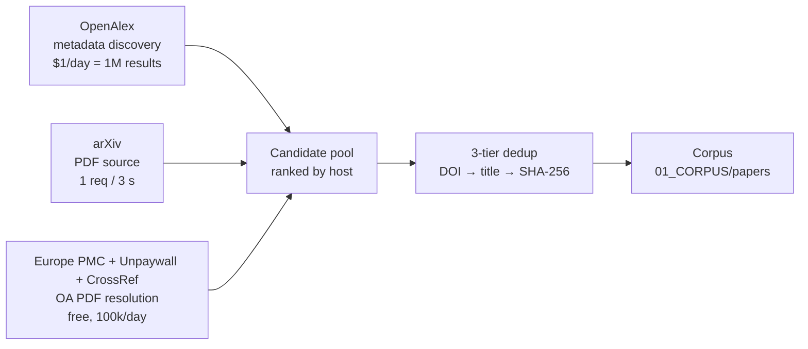

# Project Arkais — Source API Capacity & Throughput Ceilings

Reference for how fast the corpus harvester can legally grow, per upstream platform.
Companion to [quickstart.md](quickstart.md). All figures verified against live vendor
documentation (September 2026).

---

## 1. Per-Platform Limits

| Platform | Auth | Hard cap | Daily ceiling | Cost |
| --- | --- | --- | --- | --- |
| **arXiv** | none | **1 request / 3 s**, one connection | ~28,800 req/day | free |
| **OpenAlex** | free key | **100 req/s** burst | **$1/day** credit = **10,000 filtered calls = 1,000,000 results** | $0.10 / 1,000 list calls |
| **OpenAlex** (content) | free key | — | **100 PDFs/day** | $10 / 1,000 downloads |
| **Unpaywall** | `?email=` | — | **100,000 calls/day** | free |
| **Semantic Scholar** | free key | **1 RPS per key** | ~86,400 req/day | free |
| **CrossRef** | `mailto` | polite pool, back off on `429` | no published cap | free |
| **Europe PMC** | none | — | no published cap (bulk FTP / OAI available) | free |

OpenAlex paid tiers raise the budget, not the burst cap:
Member **$5k/yr → $20/day** · Member+ **$10k/yr → $100/day** · Partner **$20k+/yr → $200+/day**.

---

## 2. Why More Emails Do Not Multiply Throughput

OpenAlex no longer budgets **per email address**. It budgets **per API key**, and every
free account receives its own **$1/day** credit. Additional accounts therefore *do* stack
their budgets — but that only matters if budget is the constraint. It is not:

- A 100-paper harvest issues roughly **25 OpenAlex list calls** → **$0.0025** of the $1/day credit.
- 500 papers → ~**$0.0125**. We use **~1.25 %** of a single free key's daily credit.
- The expensive OpenAlex endpoint is *content download* (**$10 / 1,000 = 100 PDFs/day**). We never
  call it: PDFs come from arXiv (free) and repository hosts (free).

The binding constraint is **arXiv's 1 request / 3 s** rule, which is a single-connection
politeness rule and cannot be raised by any key, account, or payment. Only **host
diversity** — fanning out across arXiv, Unpaywall-resolved repositories, Europe PMC, and
CrossRef OA links — multiplies real throughput.

---

## 3. Throughput Model



Metadata discovery is effectively unlimited; **PDF acquisition is the rate-limited leg**.
Projected wall-clock for a single run, assuming the arXiv share is served at the 3 s
politeness interval:

| Run size | OpenAlex calls | Est. duration | Dominant constraint |
| --- | --- | --- | --- |
| **100 papers** | ~25 | **~5 min** (measured) | none |
| **500 papers** | ~125 (~$0.013) | ~25 min | PDF fetch latency |
| **2,000 papers** | ~500 (~$0.05) | ~1.7 h | PDF fetch latency |
| **5,000 papers** | ~1,250 (~$0.13) | **~4.2 h** | arXiv 1 req / 3 s |

All four sizes sit far inside every documented daily ceiling. Long runs are bounded by
politeness, not quota.

---

## 4. Operational Rules

1. **Never parallelise across arXiv IPs.** Sequential within one connection, 3 s apart.
2. **Prefer repository PDFs over publisher landing pages.** The harvester ranks
   repository hosts (`arxiv.org`, `hal.science`, `ncbi.nlm.nih.gov`, `*.dspace`, …)
   above known landing-page hosts (`dl.acm.org`, `academic.oup.com`, `tandfonline.com`).
3. **Always send a contact identity.** `mailto` on OpenAlex and CrossRef, `email` on
   Unpaywall. Polite-pool access is what keeps these endpoints free.
4. **Do not use the OpenAlex content-download API** while arXiv and Unpaywall provide the
   same PDFs at zero cost.
5. **Rotate keys only to raise burst limits,** never to escape a spent budget — the budget
   is not the bottleneck. Configure `OPENALEX_API_KEYS` (comma-separated) to round-robin.

---

## 5. Configuration

```bash
# Optional. Keyless operation is fully supported at current volumes.
export OPENALEX_API_KEY="your-free-key"           # openalex.org/settings/api
export OPENALEX_API_KEYS="key_one,key_two"        # round-robin across accounts
export OPENALEX_POLITE_EMAIL="you@example.org"    # polite-pool identity
```

Keys are never transmitted to NGT infrastructure; see the BYOK section of
[quickstart.md](quickstart.md).
